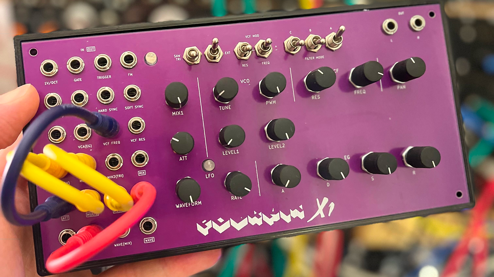

# Polykit X1 Semi Modular Synthesizer

This repository contains schematics, PCB layout files and front panel for an analog, semi modular, patchable synthesizer. It is an interface that works in conjunction with my voice card https://github.com/polykit/polykit-x-voice-card

Specs of the voice card:

* a VCO with saw, pulse and triangle signal
* an envelope generator
* a multimode filter with 8 different filter responses
* an external input
* and a panning stereo output

See voice card repository for a full feature list.

Specs of the semi modular interface:

* a LFO where the waveform can be blended between triangle and pulse signal
* a wave folder
* a two channel mixer where one input can be attenuated
* an additional attenuator
* a buffered multiple
* different offset voltages
* and a power supply
* 3D printable case

Video playlist on its functionality and design process: https://www.youtube.com/watch?v=2grRbG7IwDw&list=PLUKLEU8jmlbHH4_13YZM0MI6ez4gYQPfy

Gerber files [can be found here](plots/), front panel files are located [here](frontpanel).

## BOM

|Ref                                                                                                                                                      |Qnty|Value              |Name                  |Description                                                             |
|---------------------------------------------------------------------------------------------------------------------------------------------------------|----|-------------------|----------------------|------------------------------------------------------------------------|
|C1, C2                                                                                                                                                   |2   |1000uF             |C_Polarized           |Polarized capacitor                                                     |
|C3, C4                                                                                                                                                   |2   |100uF              |C_Polarized           |Polarized capacitor                                                     |
|C5, C6                                                                                                                                                   |2   |10uF               |C_Polarized           |Polarized capacitor                                                     |
|C7, C8                                                                                                                                                   |2   |1uF                |C_Polarized           |Polarized capacitor                                                     |
|C9                                                                                                                                                       |1   |2u2 NP             |C                     |Unpolarized capacitor                                                   |
|C10, C11, C12, C13, C14                                                                                                                                  |5   |100n               |C                     |Unpolarized capacitor                                                   |
|D1                                                                                                                                                       |1   |LED                |LED                   |Light emitting diode                                                    |
|D2, D3                                                                                                                                                   |2   |US1G               |US1G                  |400V, 1A, General Purpose Rectifier Diode, SMA(DO-214AC)                |
|D4, D6, D7, D8, D9, D10, D11, D12, D13, D14, D15                                                                                                         |11  |BAS85              |D_Schottky            |Schottky diode                                                          |
|D5                                                                                                                                                       |1   |Dual LED           |LED_Dual_Bidirectional|Dual LED, bidirectional                                                 |
|J1                                                                                                                                                       |1   |OUT LEFT           |AudioJack2_SwitchT    |Audio Jack, 2 Poles (Mono / TS), https://www.thonk.co.uk/shop/thonkiconn|
|J2                                                                                                                                                       |1   |OUT RIGHT          |AudioJack2_SwitchT    |Audio Jack, 2 Poles (Mono / TS), https://www.thonk.co.uk/shop/thonkiconn|
|J3                                                                                                                                                       |1   |ADSR_OUT           |AudioJack2_SwitchT    |Audio Jack, 2 Poles (Mono / TS), https://www.thonk.co.uk/shop/thonkiconn|
|J4                                                                                                                                                       |1   |GATE               |AudioJack2_SwitchT    |Audio Jack, 2 Poles (Mono / TS), https://www.thonk.co.uk/shop/thonkiconn|
|J5                                                                                                                                                       |1   |TRIGGER            |AudioJack2_SwitchT    |Audio Jack, 2 Poles (Mono / TS), https://www.thonk.co.uk/shop/thonkiconn|
|J6                                                                                                                                                       |1   |Conn_01x36         |Conn_01x36            |Pinheader, 01x36                                                        |
|J7                                                                                                                                                       |1   |12V AC             |Jack-DC               |DC Barrel Jack                                                          |
|J8                                                                                                                                                       |1   |LFO                |AudioJack2_SwitchT    |Audio Jack, 2 Poles (Mono / TS), https://www.thonk.co.uk/shop/thonkiconn|
|J9                                                                                                                                                       |1   |PAN_CV             |AudioJack2_SwitchT    |Audio Jack, 2 Poles (Mono / TS), https://www.thonk.co.uk/shop/thonkiconn|
|J10                                                                                                                                                      |1   |PWM CV             |AudioJack2_SwitchT    |Audio Jack, 2 Poles (Mono / TS), https://www.thonk.co.uk/shop/thonkiconn|
|J11                                                                                                                                                      |1   |RES CV             |AudioJack2_SwitchT    |Audio Jack, 2 Poles (Mono / TS), https://www.thonk.co.uk/shop/thonkiconn|
|J12                                                                                                                                                      |1   |FREQ CV            |AudioJack2_SwitchT    |Audio Jack, 2 Poles (Mono / TS), https://www.thonk.co.uk/shop/thonkiconn|
|J13                                                                                                                                                      |1   |PITCH CV 1V/OCT    |AudioJack2_SwitchT    |Audio Jack, 2 Poles (Mono / TS), https://www.thonk.co.uk/shop/thonkiconn|
|J14                                                                                                                                                      |1   |EXT IN             |AudioJack2_SwitchT    |Audio Jack, 2 Poles (Mono / TS), https://www.thonk.co.uk/shop/thonkiconn|
|J15                                                                                                                                                      |1   |VCA CV             |AudioJack2_SwitchT    |Audio Jack, 2 Poles (Mono / TS), https://www.thonk.co.uk/shop/thonkiconn|
|J16                                                                                                                                                      |1   |HARD SYNC          |AudioJack2_SwitchT    |Audio Jack, 2 Poles (Mono / TS), https://www.thonk.co.uk/shop/thonkiconn|
|J17                                                                                                                                                      |1   |SOFT SYNC          |AudioJack2_SwitchT    |Audio Jack, 2 Poles (Mono / TS), https://www.thonk.co.uk/shop/thonkiconn|
|J18                                                                                                                                                      |1   |FM                 |AudioJack2_SwitchT    |Audio Jack, 2 Poles (Mono / TS), https://www.thonk.co.uk/shop/thonkiconn|
|J19                                                                                                                                                      |1   |MULT               |AudioJack2_SwitchT    |Audio Jack, 2 Poles (Mono / TS), https://www.thonk.co.uk/shop/thonkiconn|
|J20                                                                                                                                                      |1   |WAVE IN            |AudioJack2_SwitchT    |Audio Jack, 2 Poles (Mono / TS), https://www.thonk.co.uk/shop/thonkiconn|
|J21                                                                                                                                                      |1   |ATT IN (+5V)       |AudioJack2_SwitchT    |Audio Jack, 2 Poles (Mono / TS), https://www.thonk.co.uk/shop/thonkiconn|
|J22                                                                                                                                                      |1   |MULT1              |AudioJack2_SwitchT    |Audio Jack, 2 Poles (Mono / TS), https://www.thonk.co.uk/shop/thonkiconn|
|J23                                                                                                                                                      |1   |MULT2              |AudioJack2_SwitchT    |Audio Jack, 2 Poles (Mono / TS), https://www.thonk.co.uk/shop/thonkiconn|
|J24                                                                                                                                                      |1   |ATT OUT            |AudioJack2_SwitchT    |Audio Jack, 2 Poles (Mono / TS), https://www.thonk.co.uk/shop/thonkiconn|
|J25                                                                                                                                                      |1   |MIX IN2            |                      |Can be used as default input for MIX2 when not patched                  |
|J26                                                                                                                                                      |1   |MIX IN1 (-5V)      |AudioJack2_SwitchT    |Audio Jack, 2 Poles (Mono / TS), https://www.thonk.co.uk/shop/thonkiconn|
|J27                                                                                                                                                      |1   |MIX IN2            |AudioJack2_SwitchT    |Audio Jack, 2 Poles (Mono / TS), https://www.thonk.co.uk/shop/thonkiconn|
|J28                                                                                                                                                      |1   |WAVE OUT           |AudioJack2_SwitchT    |Audio Jack, 2 Poles (Mono / TS), https://www.thonk.co.uk/shop/thonkiconn|
|J29                                                                                                                                                      |1   |MIX OUT            |AudioJack2_SwitchT    |Audio Jack, 2 Poles (Mono / TS), https://www.thonk.co.uk/shop/thonkiconn|
|Q1, Q3                                                                                                                                                   |2   |BC847              |BC847                 |0.1A Ic, 45V Vce, NPN Transistor, SOT-23                                |
|Q2                                                                                                                                                       |1   |BC857              |BC857                 |0.1A Ic, 45V Vce, PNP Transistor, SOT-23                                |
|R1, R18, R19, R47, R50                                                                                                                                   |5   |10k                |R                     |Resistor                                                                |
|R2, R3, R4, R5, R20, R21, R45, R46, R54, R58                                                                                                             |10  |1k                 |R                     |Resistor                                                                |
|R10                                                                                                                                                      |1   |100                |R                     |Resistor                                                                |
|R11, R12, R13, R15, R22, R23, R24, R25, R27, R28, R29, R30, R31, R32, R33, R34, R35, R36, R37, R38, R39, R40, R41, R43, R44, R51, R52, R53, R55, R56, R57|31  |100k               |R                     |Resistor                                                                |
|R14                                                                                                                                                      |1   |220k               |R                     |Resistor                                                                |
|R16                                                                                                                                                      |1   |15k                |R                     |Resistor                                                                |
|R17, R48, R49                                                                                                                                            |3   |12k                |R                     |Resistor                                                                |
|R26                                                                                                                                                      |1   |47k                |R                     |Resistor                                                                |
|R42                                                                                                                                                      |1   |470k               |R                     |Resistor                                                                |
|RV1                                                                                                                                                      |1   |B100k LEVEL1       |R_POT-Device          |Potentiometer RK097 Vertical                                            |
|RV2                                                                                                                                                      |1   |B100k LEVEL2       |R_POT-Device          |Potentiometer RK097 Vertical                                            |
|RV3                                                                                                                                                      |1   |10k LFO TRIM       |R_Potentiometer_Trim  |Trim-potentiometer                                                      |
|RV4                                                                                                                                                      |1   |B1M LFO RATE       |R_POT-Device          |Potentiometer RK097 Vertical                                            |
|RV5                                                                                                                                                      |1   |B100k LFO WAVE     |R_POT-Device          |Potentiometer RK097 Vertical                                            |
|RV6                                                                                                                                                      |1   |B100k PANNING      |R_POT-Device          |Potentiometer RK097 Vertical                                            |
|RV7                                                                                                                                                      |1   |B100k A            |R_POT-Device          |Potentiometer RK097 Vertical                                            |
|RV8                                                                                                                                                      |1   |B100k D            |R_POT-Device          |Potentiometer RK097 Vertical                                            |
|RV9                                                                                                                                                      |1   |B100k S            |R_POT-Device          |Potentiometer RK097 Vertical                                            |
|RV10                                                                                                                                                     |1   |B100k R            |R_POT-Device          |Potentiometer RK097 Vertical                                            |
|RV11                                                                                                                                                     |1   |B100k RES          |R_POT-Device          |Potentiometer RK097 Vertical                                            |
|RV12                                                                                                                                                     |1   |B100k FREQ         |R_POT-Device          |Potentiometer RK097 Vertical                                            |
|RV13                                                                                                                                                     |1   |B100k PWM          |R_POT-Device          |Potentiometer RK097 Vertical                                            |
|RV14                                                                                                                                                     |1   |B100k TUNE         |R_POT-Device          |Potentiometer RK097 Vertical                                            |
|RV15                                                                                                                                                     |1   |B100k ATT          |R_POT-Device          |Potentiometer RK097 Vertical                                            |
|RV16                                                                                                                                                     |1   |B100k MIX IN1 LEVEL|R_POT-Device          |Potentiometer RK097 Vertical                                            |
|SW1                                                                                                                                                      |1   |EXT_ON             |SW_SPDT               |Switch, single pole double throw                                        |
|SW2                                                                                                                                                      |1   |FILTER_A           |SW_SPDT               |Switch, single pole double throw                                        |
|SW3                                                                                                                                                      |1   |FILTER_B           |SW_SPDT               |Switch, single pole double throw                                        |
|SW4                                                                                                                                                      |1   |FILTER_C           |SW_SPDT               |Switch, single pole double throw                                        |
|SW5                                                                                                                                                      |1   |RES_MODE           |SW_SPDT_MSM           |Switch, single pole double throw, center OFF position                   |
|SW6                                                                                                                                                      |1   |FREQ_MODE          |SW_SPDT_MSM           |Switch, single pole double throw, center OFF position                   |
|SW7                                                                                                                                                      |1   |SAW_TRIANGLE       |SW_SPDT               |Switch, single pole double throw                                        |
|U1                                                                                                                                                       |1   |MC78M12_TO252      |78M12 TO-252          |Positive 500mA 35V Linear Regulator, Fixed Output 5V, TO-252 (D-PAK)    |
|U2                                                                                                                                                       |1   |MC79M12_TO252      |79M12 TO-252          |Negative 500mA 35V Linear Regulator, Fixed Output -12V, TO-252 (D-PAK)  |
|U3                                                                                                                                                       |1   |L78L05_SO8         |78L05 SO-8            |Positive 100mA 30V Linear Regulator, Fixed Output 5V, SO-8              |
|U4                                                                                                                                                       |1   |L79L05_SO8         |79L05 SO-8            |Negative 100mA -30V Linear Regulator, Fixed Output -5V, SO-8            |
|U5, U6, U7, U8                                                                                                                                           |4   |TL074              |TL074                 |Quad Low-Noise JFET-Input Operational Amplifiers, DIP-14/SOIC-14        |
|U9                                                                                                                                                       |1   |TL072              |TL072                 |Dual Low-Noise JFET-Input Operational Amplifiers, DIP-8/SOIC-8          |

## References

https://github.com/polykit/polykit-x-voice-card

https://www.elby-designs.com/webtek/cgs/cgs52/cgs52_folder.html
